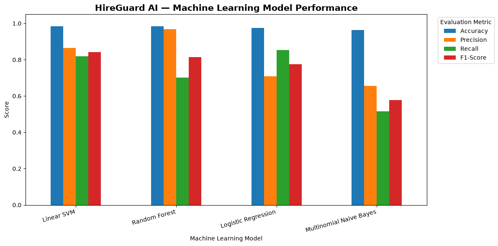

# 🛡️ HireGuard AI — Recruitment Fraud Detection

> An end-to-end NLP and Machine Learning system for detecting potentially fraudulent online job advertisements.

**HireGuard AI** analyzes job advertisement text and classifies it as either **Likely Legitimate** or **Potentially Fraudulent**.

Unlike a notebook-only ML project, HireGuard AI combines a complete Data Science workflow with a **trained NLP model, FastAPI REST API, and interactive web frontend**, turning the model into a usable full-stack Machine Learning application.

---

## ✨ Project Highlights

- 📊 End-to-end Data Science workflow
- 🧹 Data cleaning and preprocessing
- 🔍 Exploratory Data Analysis
- 📝 Natural Language Processing
- 🔢 TF-IDF feature extraction
- 🤖 Four Machine Learning models compared
- 🎯 Hyperparameter tuning
- 🏆 Linear SVM selected as the final model
- ⚡ FastAPI REST API
- 💻 HTML/CSS/JavaScript frontend
- 🔄 Real-time ML predictions
- 💾 Serialized model and vectorizer
- 🛡️ Responsible risk-based prediction design

---

## 🖥️ HireGuard AI Interface


### 🚨 Potentially Fraudulent Prediction


### ✅ Likely Legitimate Prediction


---

## 🎯 Problem Statement

Online recruitment platforms make job searching easier, but they can also be exploited by scammers posting fake job opportunities.

Fraudulent advertisements may contain patterns such as:

- Unrealistic salaries
- Registration or training fees
- No-interview claims
- Suspicious work-from-home offers
- Requests for personal information
- Misleading company descriptions
- Urgent recruitment language

The goal of **HireGuard AI** is to use Natural Language Processing and Machine Learning to identify textual patterns associated with fraudulent recruitment advertisements.

The system classifies an advertisement as:

```text
✅ Likely Legitimate
```

or

```text
🚨 Potentially Fraudulent
```

The prediction is designed as a **risk indicator**, not definitive proof of fraud.

---

# 📊 Dataset

HireGuard AI uses the **Real / Fake Job Posting Prediction** dataset.

The original dataset contains real and fraudulent job advertisements with attributes including:

- Job title
- Location
- Department
- Company profile
- Description
- Requirements
- Benefits
- Employment type
- Required experience
- Required education
- Industry
- Function
- Fraudulent label

### Dataset After Preprocessing

| Category | Count |
|---|---:|
| Total Job Postings | 17,632 |
| Legitimate Postings | 16,776 |
| Fraudulent Postings | 856 |
| Fraud Rate | 4.85% |

The target variable is therefore **highly imbalanced**.

Because fraudulent advertisements represent only **4.85%** of the processed dataset, model selection was not based on accuracy alone.

Special attention was given to:

- Precision
- Recall
- F1-score

### Dataset Source

**Kaggle — Real / Fake Job Posting Prediction**

Dataset author: Shivam Bansal

https://www.kaggle.com/datasets/shivamb/real-or-fake-fake-jobposting-prediction

> The raw dataset is not stored directly in this repository because of repository/browser upload size limitations. Dataset setup instructions are available in the `data` directory.

---

# 🔍 Exploratory Data Analysis

The project performs Exploratory Data Analysis before model development.

The analysis includes:

- Dataset structure
- Missing-value analysis
- Target distribution
- Fraud-rate analysis
- Text-length analysis
- Fraudulent advertisement patterns
- Legitimate advertisement patterns
- Word-frequency analysis
- Class imbalance visualization

One of the most important observations was the strong imbalance between legitimate and fraudulent advertisements.

---

# 🧹 Data Preprocessing

The NLP preprocessing workflow prepares raw job advertisements for Machine Learning.

Major steps include:

1. Handling missing values
2. Removing unnecessary columns
3. Combining relevant text fields
4. Converting text to lowercase
5. Removing URLs
6. Removing punctuation and unwanted characters
7. Removing unnecessary whitespace
8. Preparing the cleaned text for vectorization

### Processing Pipeline

```text
Raw Job Advertisement
        ↓
Data Cleaning
        ↓
Text Preprocessing
        ↓
Combined Text
        ↓
TF-IDF Vectorization
        ↓
Machine Learning Model
        ↓
Fraud Risk Prediction
```

---

# 🧠 NLP & Feature Engineering

## TF-IDF Vectorization

HireGuard AI uses **TF-IDF (Term Frequency–Inverse Document Frequency)** to convert textual job advertisements into numerical feature vectors.

TF-IDF assigns higher importance to terms that are relevant to a particular advertisement while reducing the importance of extremely common words.

The resulting sparse feature matrix is used to train the classification algorithms.

---

# 🤖 Machine Learning Models

Four Machine Learning algorithms were evaluated.

| Model | Accuracy | Fraud Precision | Fraud Recall | Fraud F1 |
|---|---:|---:|---:|---:|
| Logistic Regression | 97.59% | 70.87% | **85.38%** | 77.45% |
| Multinomial Naive Bayes | 96.34% | 65.67% | 51.46% | 57.70% |
| Random Forest | 98.44% | **96.77%** | 70.18% | 81.36% |
| **Linear SVM** | **98.50%** | 86.42% | 81.87% | **84.08%** |

---

# 🏆 Final Model — Linear SVM

After model comparison, **Linear Support Vector Machine (Linear SVM)** was selected as the final classifier.

Hyperparameter tuning identified:

```text
Best C = 1.0
```

### Final Test Performance

| Metric | Score |
|---|---:|
| Accuracy | **98.50%** |
| Fraud Precision | **86.42%** |
| Fraud Recall | **81.87%** |
| Fraud F1-Score | **84.08%** |

### Classification Report

```text
              precision    recall    f1-score    support

Legitimate       0.99       0.99       0.99        3356
Fraudulent       0.86       0.82       0.84         171

accuracy                               0.98        3527
macro avg        0.93       0.91       0.92        3527
weighted avg     0.98       0.98       0.98        3527
```

---

## 📈 Model Performance



---

# 🔢 Confusion Matrix

The final Linear SVM produced:

| | Predicted Legitimate | Predicted Fraudulent |
|---|---:|---:|
| **Actual Legitimate** | 3334 | 22 |
| **Actual Fraudulent** | 31 | 140 |

Therefore:

- **3334** legitimate advertisements were correctly classified.
- **140** fraudulent advertisements were correctly detected.
- **22** legitimate advertisements were incorrectly flagged.
- **31** fraudulent advertisements were missed.

---

# 📈 Why F1-Score Matters

Accuracy can be misleading for an imbalanced classification problem.

Because only **4.85%** of the processed advertisements are fraudulent, a model predicting almost everything as legitimate could still obtain high accuracy.

For this reason:

**Precision** measures how many advertisements predicted as fraudulent were actually fraudulent.

**Recall** measures how many actual fraudulent advertisements were successfully detected.

**F1-score** balances precision and recall.

The final Linear SVM achieved a **fraud-class F1-score of 84.08%**, making it the strongest overall model in this project.

---

# 💾 Model Serialization

The trained model and fitted TF-IDF vectorizer are saved using `joblib`.

```text
models/
├── hireguard_svm_model.pkl
└── hireguard_tfidf_vectorizer.pkl
```

Saving both components allows the backend to perform predictions without retraining the model every time the application starts.

---

# 🏗️ System Architecture

```text
┌──────────────────────────────┐
│        User / Browser        │
└──────────────┬───────────────┘
               │
               ▼
┌──────────────────────────────┐
│     HTML / CSS / JavaScript  │
│           Frontend           │
└──────────────┬───────────────┘
               │
               │ HTTP POST
               ▼
┌──────────────────────────────┐
│          FastAPI API         │
│       /predict endpoint      │
└──────────────┬───────────────┘
               │
               ▼
┌──────────────────────────────┐
│       Text Preprocessing     │
└──────────────┬───────────────┘
               │
               ▼
┌──────────────────────────────┐
│       TF-IDF Vectorizer      │
└──────────────┬───────────────┘
               │
               ▼
┌──────────────────────────────┐
│          Linear SVM          │
└──────────────┬───────────────┘
               │
               ▼
┌──────────────────────────────┐
│ Prediction + Decision Score  │
└──────────────────────────────┘
```

---

# ⚡ FastAPI Backend

The trained Machine Learning pipeline is exposed through a REST API built with **FastAPI**.

The backend:

- Loads the trained Linear SVM model
- Loads the TF-IDF vectorizer
- Accepts job advertisement text
- Cleans incoming text
- Vectorizes the advertisement
- Performs inference
- Generates the SVM decision score
- Returns a JSON response

### API Endpoints

```text
GET  /
GET  /health
POST /predict
```

After starting the backend, Swagger API documentation is available at:

```text
http://127.0.0.1:8000/docs
```

### Example Fraud-Risk Response

```json
{
  "prediction": "Potentially Fraudulent",
  "decision_score": 0.3793,
  "model": "Linear SVM",
  "disclaimer": "Prediction is a risk indicator and not definitive proof of fraud."
}
```

### Example Legitimate Response

```json
{
  "prediction": "Likely Legitimate",
  "decision_score": -0.9572,
  "model": "Linear SVM",
  "disclaimer": "Prediction is a risk indicator and not definitive proof of fraud."
}
```

> The Linear SVM decision score represents the model's position relative to its decision boundary. It should **not** be interpreted as a probability of fraud.

---

# 💻 Interactive Frontend

The HireGuard AI interface is built using:

- HTML5
- CSS3
- JavaScript
- Fetch API

Users can paste a job advertisement into the interface and receive a real-time Machine Learning assessment.

The interface displays:

- Classification
- Decision score
- Model name
- Risk explanation
- Responsible-use disclaimer
- AI engine/backend status

---

# 🛡️ Responsible AI Design

HireGuard deliberately returns:

```text
Potentially Fraudulent
```

instead of:

```text
Fraudulent
```

and:

```text
Likely Legitimate
```

instead of guaranteeing that an advertisement is legitimate.

Machine Learning predictions can be incorrect.

HireGuard AI should therefore be treated as a **screening and risk-assessment tool**, not an automated authority.

Users should independently verify:

- Employer identity
- Official company website
- Recruiter identity
- Application source
- Requests for payment
- Requests for sensitive personal information

---

# 🗂️ Project Structure

```text
HireGuard-AI-Recruitment-Fraud-Detection/
│
├── backend/
│   └── main.py
│
├── data/
│   └── README.md
│
├── frontend/
│   ├── index.html
│   ├── style.css
│   └── script.js
│
├── images/
│   ├── hireguard-home.png
│   ├── fraudulent-prediction.png
│   ├── legitimate-prediction.png
│   └── model-comparison.png
│
├── models/
│   ├── hireguard_svm_model.pkl
│   └── hireguard_tfidf_vectorizer.pkl
│
├── notebooks/
│   └── HireGuard_AI_Final_Project.ipynb
│
├── .gitignore
├── LICENSE
├── requirements.txt
└── README.md
```

---

# 🛠️ Technologies Used

### Data Science & NLP

- Python
- Pandas
- NumPy
- Matplotlib
- NLTK
- WordCloud
- TF-IDF

### Machine Learning

- Scikit-learn
- Logistic Regression
- Multinomial Naive Bayes
- Linear SVM
- Random Forest
- GridSearchCV
- Joblib

### Backend

- FastAPI
- Uvicorn
- Pydantic

### Frontend

- HTML5
- CSS3
- JavaScript
- Fetch API

### Development Tools

- Visual Studio Code
- Jupyter Notebook
- Git
- GitHub

---

# ⚙️ Installation

## 1. Clone the Repository

```bash
git clone https://github.com/yashikaaaaaaa/HireGuard-AI-Recruitment-Fraud-Detection.git
cd HireGuard-AI-Recruitment-Fraud-Detection
```

## 2. Create a Virtual Environment

```bash
python -m venv venv
```

### Windows PowerShell

```powershell
.\venv\Scripts\Activate.ps1
```

If PowerShell blocks script execution:

```powershell
Set-ExecutionPolicy -Scope Process -ExecutionPolicy RemoteSigned
.\venv\Scripts\Activate.ps1
```

## 3. Install Dependencies

```bash
pip install -r requirements.txt
```

The trained model and TF-IDF vectorizer are already included, so the dataset is **not required simply to run the web application**.

---

# 🚀 Running HireGuard AI

HireGuard uses separate backend and frontend servers.

## Terminal 1 — Start the Backend

From the project root:

```bash
python -m uvicorn backend.main:app --reload
```

Backend:

```text
http://127.0.0.1:8000
```

Swagger API:

```text
http://127.0.0.1:8000/docs
```

Keep this terminal running.

---

## Terminal 2 — Start the Frontend

Open another terminal.

```bash
cd frontend
python -m http.server 5501
```

Then open:

```text
http://127.0.0.1:5501
```

### Alternative — VS Code Live Server

Open:

```text
frontend/index.html
```

and select:

```text
Open with Live Server
```

The exact Live Server port may vary.

---

# 🧪 Test the Application

### Suspicious Job Example

```text
URGENT WORK FROM HOME OPPORTUNITY!

Earn 50000 per week with no experience required.
No interview required.

Candidates must pay a registration and training fee before
receiving the appointment letter.

Contact immediately through WhatsApp.
```

Expected output:

```text
🚨 Potentially Fraudulent
```

### Legitimate Job Example

```text
Software Engineer Intern

We are looking for a Software Engineering Intern to join our
development team.

Candidates should be pursuing a degree in Computer Science
or a related field.

Required skills include Python, SQL and Git.

Selected candidates will participate in a structured technical
interview process. There are no registration fees or payments
required from applicants.
```

Expected output:

```text
✅ Likely Legitimate
```

---

# 📓 Data Science Notebook

The complete Data Science workflow is available in:

```text
notebooks/HireGuard_AI_Final_Project.ipynb
```

The notebook covers:

```text
Dataset Exploration
        ↓
Exploratory Data Analysis
        ↓
Data Cleaning
        ↓
NLP Preprocessing
        ↓
TF-IDF Feature Engineering
        ↓
Train/Test Split
        ↓
Model Training
        ↓
Model Evaluation
        ↓
Model Comparison
        ↓
Hyperparameter Tuning
        ↓
Final Model Selection
        ↓
Model Serialization
        ↓
Real-Time Prediction
```

---

# 📥 Reproducing the Training Workflow

The large raw CSV dataset is not stored directly in this repository.

To reproduce model training:

1. Download the **Real / Fake Job Posting Prediction** dataset from Kaggle.
2. Create:

```text
data/
└── raw/
    └── fake_job_postings.csv
```

3. Place the downloaded CSV inside `data/raw/`.
4. Open:

```text
notebooks/HireGuard_AI_Final_Project.ipynb
```

5. Run the notebook cells in order.

The notebook will perform preprocessing, analysis, feature engineering, training and evaluation.

---

# 💡 Key Learnings

HireGuard AI demonstrates the complete lifecycle of a Machine Learning project:

- Working with a real-world dataset
- Handling class imbalance
- Exploratory Data Analysis
- NLP preprocessing
- TF-IDF feature engineering
- Training multiple classifiers
- Evaluating minority-class performance
- Hyperparameter tuning
- Confusion-matrix interpretation
- Model serialization
- Building REST APIs
- Connecting ML models to web applications
- Real-time inference
- Responsible presentation of ML predictions

---

# ⚠️ Limitations

HireGuard AI is an experimental Machine Learning system.

Current limitations include:

- Predictions depend on patterns learned from the training dataset.
- New scam strategies may differ from historical examples.
- Text alone cannot verify whether an employer legally exists.
- Legitimate advertisements may occasionally be flagged.
- Fraudulent advertisements may occasionally evade detection.
- The SVM decision score is not a calibrated probability.

The application should therefore be used as a **risk-screening tool rather than definitive proof of fraud**.

---

# 🔮 Future Improvements

Possible future extensions include:

- Transformer-based NLP models such as BERT
- Explainable AI for highlighting suspicious phrases
- Probability calibration
- URL/domain reputation analysis
- Employer verification APIs
- Recruiter email-domain analysis
- Database integration
- User authentication
- User feedback collection
- Automated model retraining
- Cloud deployment
- Model monitoring

---

# 🌟 Final Results

```text
Selected Model : Linear SVM
Best C         : 1.0

Accuracy       : 98.50%
Precision      : 86.42%
Recall         : 81.87%
F1-Score       : 84.08%
```

**HireGuard AI successfully demonstrates how an NLP classification model can be transformed from a Data Science experiment into a functional full-stack Machine Learning application.**

---

# 👩‍💻 Author

**Yashika Mohanty**

B.Tech — Computer Science & Engineering  
Data Science

This project was developed as a final end-to-end Data Science project demonstrating the integration of **Data Analysis, NLP, Machine Learning, API Development, and Frontend Engineering**.

---

# 📄 License

This project is licensed under the **MIT License**.

---

## ⭐ Support

If you find this project useful or interesting, consider giving the repository a ⭐.

---

### 🛡️ HireGuard AI

**Detect patterns. Assess risk. Apply smarter.**
